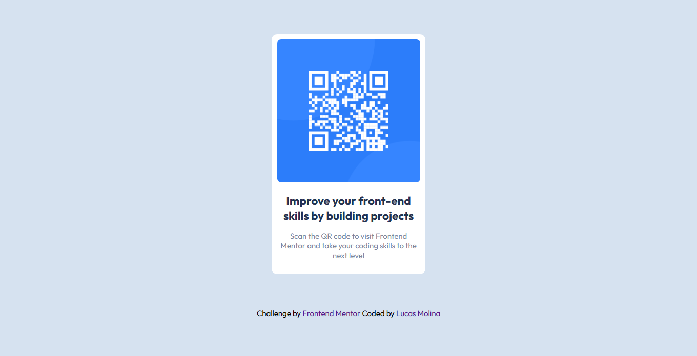

# Frontend Mentor - QR code component solution

This is a solution to the [QR code component challenge on Frontend Mentor](https://www.frontendmentor.io/challenges/qr-code-component-iux_sIO_H). Frontend Mentor challenges help you improve your coding skills by building realistic projects. 

## Table of contents

- [Overview](#overview)
  - [Screenshot](#screenshot)
  - [Links](#links)
  - [Built with](#built-with)
- [Author](#author)

## Overview

### Screenshot

### Links

- Solution URL: [Frontendmentor.io](https://www.frontendmentor.io/solutions/qr-code-component-w-html-and-css-AeV2pyYssZ)
- Live Site URL: [Github Pages](https://lucasivan.github.io/Frontend-Mentor-QR-Code-Challenge/)

### Built with

- HTML5 markup
- CSS custom properties
- Flexbox

## Author

- LinkedIn - [Lucas Molina](https://www.linkedin.com/in/lucas-molina-dev/)
- Frontend Mentor - [@LucasIvan](https://www.frontendmentor.io/profile/LucasIvan)
